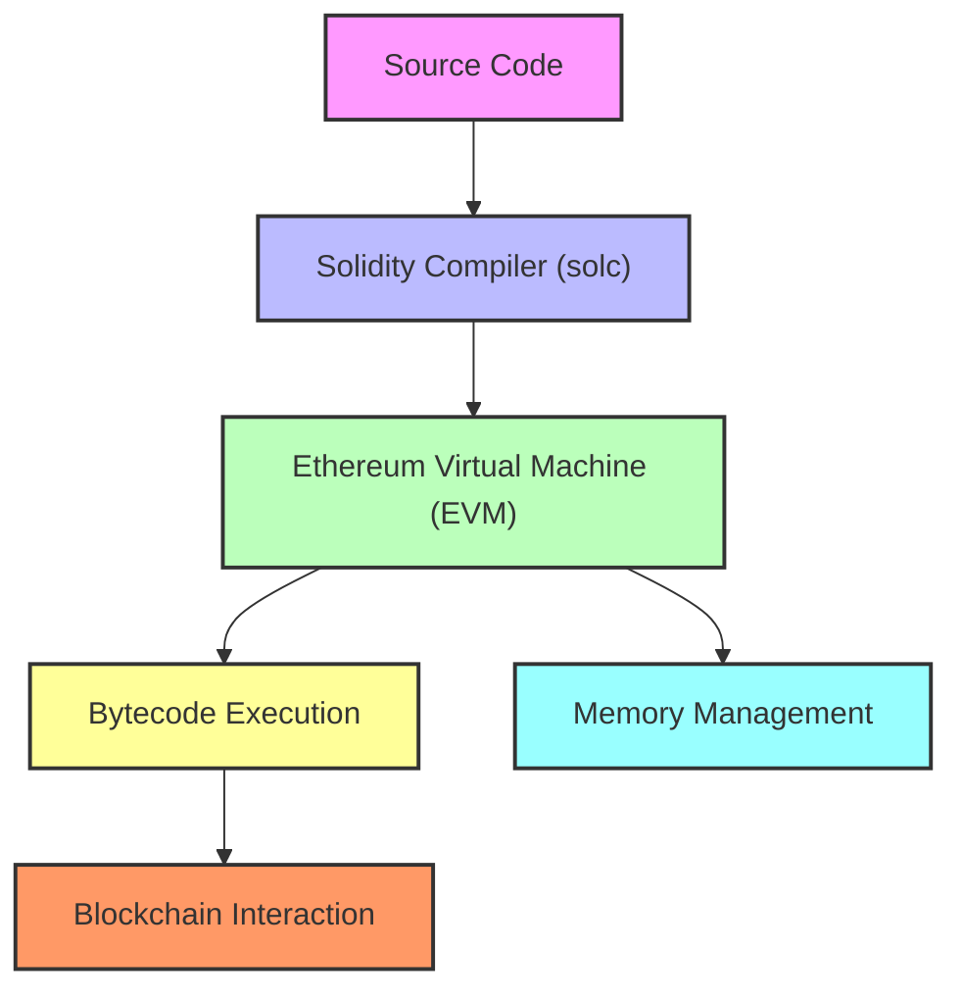

# 🏗️ Solidity Architecture: A Complete Overview

The architecture of **Solidity** revolves around various components that work together to create and execute smart contracts on the **Ethereum Virtual Machine (EVM)**. These components form the backbone of Solidity and guide the process from writing the code to executing it on the blockchain.

---

## 1. 🖥️ Source Code
- **Programming Language**: Developers write smart contracts in **Solidity**, a high-level language influenced by JavaScript, C++, and Python. The code defines the rules and logic of the contract.
  
## 2. ⚙️ Solidity Compiler (solc)
- **Compilation**: Solidity code is converted into **bytecode** using the Solidity compiler (solc). This bytecode is what the **EVM** can execute.
- **Compiler Output**: The compiler produces two critical outputs:
  - **Bytecode**: The executable binary code understood by the EVM.
  - **ABI (Application Binary Interface)**: A detailed interface that defines how external systems can interact with the contract.

## 3. 🧠 Ethereum Virtual Machine (EVM)
- **Bytecode Execution**: The bytecode runs on the **EVM**, a decentralized virtual machine distributed across Ethereum nodes. It executes the smart contract logic on the blockchain.
- **Stack-Based Architecture**: The EVM operates on a stack-based system, managing data and instructions using a fixed-size stack (256-bit per word).

---

## 4. 🧰 Memory Spaces
Solidity manages several types of memory spaces:
- **Storage**: Permanent storage on the blockchain, persisting between transactions.
- **Memory**: Temporary data storage during function execution, erased afterward.
- **Calldata**: Read-only storage for external function parameters.
- **Stack**: Temporary, low-space storage for executing functions.

## 5. 🔒 Contracts and Functions
- **Smart Contracts**: All Solidity code is written inside smart contracts, which contain functions, state variables, and events.
- **Functions**: Functions manipulate the contract's state and can have different access levels (public, private, internal).
- **Events**: Emit notifications that are stored in logs, enabling external applications to react to blockchain changes.

## 6. 🔗 Blockchain Interaction
- **Transactions**: Smart contracts respond to external account transactions, allowing functions to be executed.
- **Events and Logs**: Events are recorded in logs when triggered, which allows dapps to track blockchain events.

---

## 7. 🔄 EVM Opcodes
- **Low-Level Instructions**: The Solidity bytecode is translated into **EVM opcodes** such as **PUSH**, **ADD**, and **CALLDATALOAD**, which handle data manipulation, math operations, and memory management.

## 8. ⚠️ Error Handling
- **Exception Handling**: Solidity provides mechanisms like `require()`, `assert()`, and `revert()` to handle runtime errors. If an operation fails, any changes to the contract's state are rolled back.

## 9. 🛡️ Security
- **Visibility and Modifiers**: Solidity enforces access control through public, private, internal, and external visibility. Modifiers help control who can execute specific functions.
- **Reentrancy Protection**: Design patterns like **checks-effects-interactions** help prevent reentrancy attacks.

---

## 10. 🔌 External Interfaces
- **Interacting with Dapps**: External decentralized applications (dapps) interact with smart contracts via the **ABI** using libraries like **Web3.js** or **Ethers.js**, enabling them to trigger contract functions.

---

## 🔍 Simplified Architecture Flow:
1. **Write Solidity Code** → 2. **Compile to Bytecode & ABI** → 3. **Run Bytecode on EVM** → 4. **Execute Transactions** → 5. **Response via Events and Logs**

---

## 🛠️ Visualizing the Architecture

## 📝 Conclusion
The modular and decentralized architecture of **Solidity** allows smart contracts to operate efficiently and securely on the **Ethereum blockchain**. From writing high-level code to executing it as bytecode on the EVM, Solidity ensures the correct functioning of decentralized applications. However, while Solidity is designed to be secure, smart contracts are written by humans, which means vulnerabilities or errors can be introduced in the code. As many transition from Web2 to Web3, it is crucial to have an in-depth understanding of how blockchain works and how to mitigate these risks.

## 🧐 What’s Next?
- **Learn about Smart Contracts**: Discover how Solidity smart contracts function and interact with the blockchain.
- **Explore Dapp Development**: Learn how dapps communicate with Solidity smart contracts.
- **Delve into EVM Opcodes**: Understand the low-level instructions that power smart contract execution.