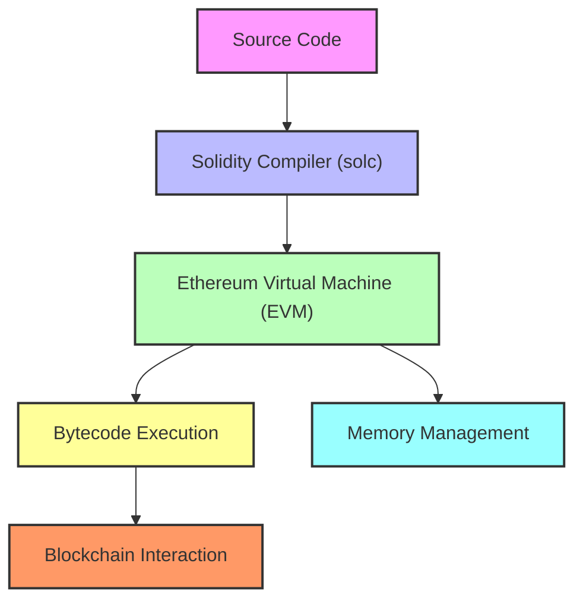

# Solidity Architecture

The architecture of **Solidity** is built on several components that interact to create and execute smart contracts on the **Ethereum Virtual Machine (EVM)**. These components form a structure that guides the process from writing the code to its execution on the blockchain. Here's a breakdown of the main aspects of Solidity’s architecture:

---

## 1. Source Code
- **Programming Language**: Developers write the code in **Solidity**, a high-level language inspired by JavaScript, C++, and Python. This code defines the rules and logic that the smart contract will follow.

## 2. Solidity Compiler (solc)
- **Compilation**: The Solidity code is converted into **bytecode** via the Solidity compiler (solc). Bytecode is the format the **EVM** understands.
- **Compiler Output**: The compiler produces two main outputs:
  - **Bytecode**: The binary code that is executable by the EVM.
  - **ABI (Application Binary Interface)**: A description of how the functions in the contract can be called from outside, such as from external applications or interfaces.

## 3. Ethereum Virtual Machine (EVM)
- **Bytecode Execution**: The bytecode is executed on the **EVM**, which is a decentralized virtual machine running across all Ethereum nodes. This is where the operations and logic of the smart contracts take place on the blockchain.
- **Stack-Based Architecture**: The EVM uses a stack-based architecture, where data and instructions are handled using a fixed-size stack (256-bit per word).

## 4. Memory Spaces
Solidity manages different types of memory spaces:
- **Storage**: Permanent storage on the blockchain. Data here persists between transactions.
- **Memory**: Temporary storage used during function execution, which is cleared afterward.
- **Calldata**: Read-only storage used for external function parameters.
- **Stack**: Small space for temporary data during execution.

## 5. Contracts and Functions
- **Smart Contracts**: In Solidity, all code resides within smart contracts, which contain functions, state variables, and events.
- **Functions**: These functions can either read or write to the contract's state. They can also have different access levels (public, private, or internal).
- **Events**: They notify external applications when specific actions occur on the blockchain.

## 6. Blockchain Interaction
- **Transactions**: Smart contracts can execute functions in response to transactions sent from external accounts.
- **Events and Logs**: When a contract emits an event, it is recorded in the blockchain logs, allowing external applications to react to changes in the contract.

## 7. EVM Opcodes
- **Low-Level Instructions**: Solidity bytecode translates into a series of **opcodes** that the EVM executes. Examples include **PUSH**, **ADD**, **CALLDATALOAD**, **SHR**, etc. These are responsible for data manipulation, mathematical operations, and memory/storage management.

## 8. Error Handling
- **Exception Handling**: Solidity provides mechanisms like `require()`, `assert()`, and `revert()` to handle runtime errors. This ensures that if an operation fails, any changes to the contract state are rolled back.

## 9. Security
- **Visibility and Modifiers**: Solidity uses access control mechanisms (public, private, internal, external) and modifiers to ensure that functions and variables are accessed in a controlled manner.
- **Reentrancy Protection**: Through design patterns like the **checks-effects-interactions**, Solidity prevents reentrancy attacks that could compromise the contract's security.

## 10. External Interfaces
- **Interaction with Dapps**: Decentralized applications (dapps) interact with smart contracts using the generated **ABIs**. Libraries like **Web3.js** or **Ethers.js** are used to connect with the blockchain and call contract functions.

---

## Simplified Architecture Flow:
1. **Write Solidity Code** → 2. **Compile to Bytecode and ABI** → 3. **Execute on the EVM** → 4. **Transactions on Blockchain** → 5. **Response via Events/Logs**

---

This modular and decentralized architecture allows smart contracts written in Solidity to run efficiently and securely on the Ethereum blockchain.
