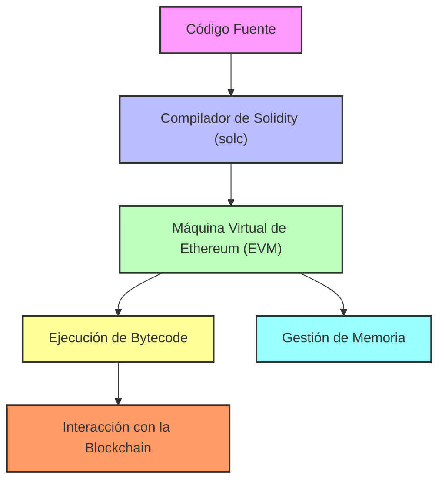

# 🏗️ Arquitectura de Solidity: Una Visión Completa

La arquitectura de **Solidity** se centra en varios componentes que trabajan juntos para crear y ejecutar contratos inteligentes en la **Máquina Virtual de Ethereum (EVM)**. Estos componentes forman la base de Solidity y guían el proceso desde la escritura del código hasta su ejecución en la blockchain.

---

## 1. 🖥️ Código Fuente
- **Lenguaje de Programación**: Los desarrolladores escriben contratos inteligentes en **Solidity**, un lenguaje de alto nivel influenciado por JavaScript, C++ y Python. El código define las reglas y la lógica del contrato.

## 2. ⚙️ Compilador de Solidity (solc)
- **Compilación**: El código en Solidity se convierte en **bytecode** utilizando el compilador de Solidity (solc). Este bytecode es lo que entiende la **EVM**.
- **Salida del Compilador**: El compilador produce dos salidas clave:
  - **Bytecode**: El código binario ejecutable por la EVM.
  - **ABI (Interfaz Binaria de Aplicación)**: Una interfaz detallada que define cómo interactuar con el contrato desde sistemas externos.

## 3. 🧠 Máquina Virtual de Ethereum (EVM)
- **Ejecución de Bytecode**: El bytecode se ejecuta en la **EVM**, una máquina virtual descentralizada distribuida en los nodos de Ethereum. Allí se lleva a cabo la lógica del contrato en la blockchain.
- **Arquitectura Basada en Pila**: La EVM opera con una arquitectura basada en pila, gestionando datos e instrucciones con una pila de tamaño fijo (256 bits por palabra).

---

## 4. 🧰 Espacios de Memoria
Solidity maneja varios tipos de espacios de memoria:
- **Storage (Almacenamiento)**: Memoria permanente en la blockchain, que persiste entre transacciones.
- **Memory (Memoria)**: Almacenamiento temporal durante la ejecución de funciones, que se borra después.
- **Calldata (Datos de Llamada)**: Memoria de solo lectura para parámetros de funciones externas.
- **Stack (Pila)**: Espacio temporal y pequeño para ejecutar funciones.

## 5. 🔒 Contratos y Funciones
- **Contratos Inteligentes**: Todo el código en Solidity se escribe dentro de contratos inteligentes, que contienen funciones, variables de estado y eventos.
- **Funciones**: Las funciones manipulan el estado del contrato y pueden tener diferentes niveles de acceso (público, privado, interno).
- **Eventos**: Emiten notificaciones que se registran en los logs, permitiendo que las aplicaciones externas reaccionen a los cambios en la blockchain.

## 6. 🔗 Interacción con la Blockchain
- **Transacciones**: Los contratos inteligentes responden a transacciones externas, permitiendo la ejecución de funciones.
- **Eventos y Logs**: Los eventos son registrados en los logs cuando se activan, permitiendo a las dapps rastrear eventos de la blockchain.

---

## 7. 🔄 Opcodes de la EVM
- **Instrucciones de Bajo Nivel**: El bytecode de Solidity se traduce en **opcodes de la EVM** como **PUSH**, **ADD**, y **CALLDATALOAD**, que se encargan de la manipulación de datos, operaciones matemáticas y gestión de memoria.

## 8. ⚠️ Manejo de Errores
- **Manejo de Excepciones**: Solidity ofrece mecanismos como `require()`, `assert()` y `revert()` para manejar errores en tiempo de ejecución. Si una operación falla, cualquier cambio en el estado del contrato se revierte.

## 9. 🛡️ Seguridad
- **Visibilidad y Modificadores**: Solidity aplica control de acceso mediante niveles de visibilidad (público, privado, interno, externo). Los modificadores ayudan a controlar quién puede ejecutar ciertas funciones.
- **Protección contra Reentrancia**: Patrones de diseño como **checks-effects-interactions** previenen ataques de reentrancia.

---

## 10. 🔌 Interfaces Externas
- **Interacción con Dapps**: Las aplicaciones descentralizadas (dapps) interactúan con contratos inteligentes a través de la **ABI**, utilizando librerías como **Web3.js** o **Ethers.js**, lo que les permite ejecutar funciones del contrato.

---

## 🔍 Flujo Simplificado de la Arquitectura:
1. **Escribir Código en Solidity** → 2. **Compilar a Bytecode y ABI** → 3. **Ejecutar Bytecode en la EVM** → 4. **Ejecutar Transacciones** → 5. **Respuesta a través de Eventos y Logs**

---

## 🛠️ Visualizando la Arquitectura

## 📝 Conclusión
La arquitectura modular y descentralizada de Solidity permite que los contratos inteligentes funcionen de manera eficiente y segura en la **blockchain de Ethereum**. Desde la escritura de código de alto nivel hasta su ejecución como bytecode en la EVM, Solidity asegura el correcto funcionamiento de las aplicaciones descentralizadas. Sin embargo, aunque Solidity está diseñado para ser seguro, los contratos inteligentes son escritos por humanos, lo que significa que pueden introducirse vulnerabilidades o errores en el código. Dado que muchos están transitando de Web2 a Web3, es fundamental tener un conocimiento profundo sobre cómo funciona la blockchain y cómo se pueden mitigar estos riesgos.

## 🧐 ¿Qué Sigue?
- **Aprende sobre Contratos Inteligentes**: Descubre cómo funcionan los contratos inteligentes de Solidity y cómo interactúan con la blockchain.
- **Explora el Desarrollo de Dapps**: Aprende cómo las dapps se comunican con los contratos inteligentes de Solidity.
- **Profundiza en los Opcodes de la EVM**: Entiende las instrucciones de bajo nivel que impulsan la ejecución de contratos inteligentes.